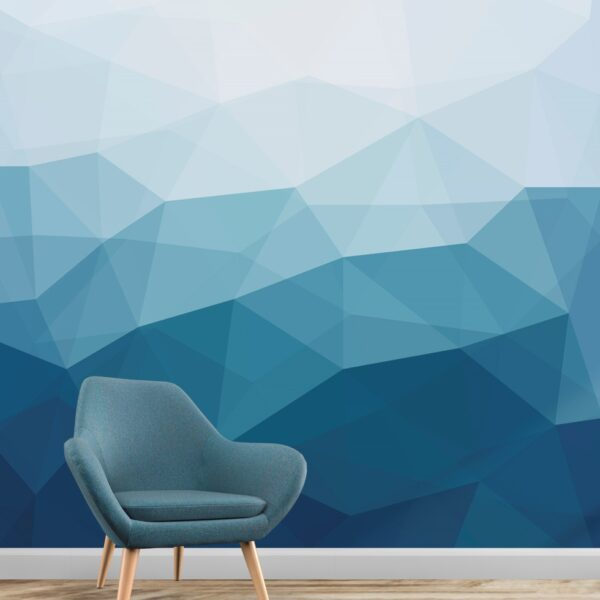
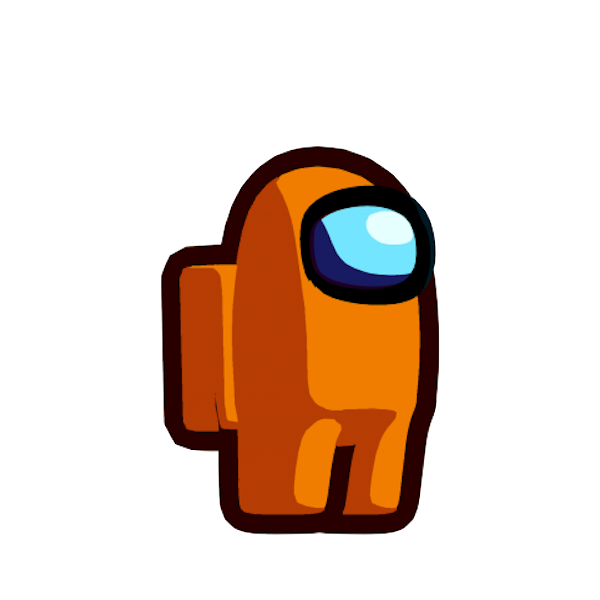
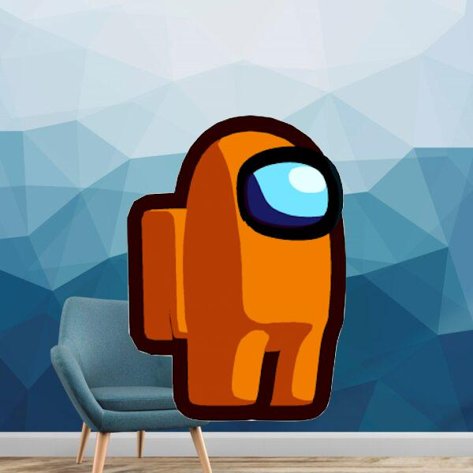

# NFT Art Generator

A program that creates generative art by layering various PNG files ontop of eachother then converts the resulting image into a JPEG. A JSON file reflecting the image attributes will also be created uner the same name.

The program uses the Pillow (8.1.0) library to manipulate images. This is done by layering several PNG files directly ontop of eachother then combining them into a single file.

For example, we will combine two saple images.

Background            |  Foreground | Result
:-------------------------:|:-------------------------:|:-------------------------:
  |   | 

The resulting JSON file will also be created:
```
{"background": "Office", "foreground": "2"}
```

## Prerequisites

Must have Python (3.8) and (optionally) pip (python package installer) in order to run this program.

Once installed, run `pip install -r requirements.txt` in order to download necessary dependencies.

## Setup

Before drawing/obtaining your art for your NFT project, it will be necessary for all images to be the same size. If your images in one layer are 600x600, then all images in all layers need to be 600x600 in order for this program to work correctly.

The `layers.txt` file contains your image layers (new-line-delimited). The generative art will be layered in order, meaning the first line item on the file is your bottom layer and the successive lines will be placed ontop of eachother.

Once you've defined your layers in `layers.txt` you will need to create the respective folder for each layer in `images`. For instance, if you had a `background` and `foreground` entry in `layers.txt` then the program will expect for a `background` and `foreground` subfolder inside of the `images` folder. You will also need at least one file in each folder.

The layer folder represents an attribute of the generated NFT. The name of your files will represent the possible values of that attribute.

## Usage

To run the program, enter `python main.py` in your terminal.

You should see this:
```
No options specified.
Usage [short]: python main.py -l 10000 -s 1 -rr 1000
Usage [long]: python main.py --limit=10000 --scale=1 --reroll_limit=1000
```

You will need to specify the `limit`, `scale`, and `reroll_limit` arguments. 

The `limit` cannot be greater than the total number of combinations in your collection. So if you have 2 images in 2 layers (total 4 combinations), you will not be allowed to set a limit of greater than 4. 

The `scale` cannot be less than 1. It also cannot be greter than the number of layers in your project. So if you have 2 layers, the upper limit is 2.

If the program fails to find a unique combination, the number of rerolls will increase until it reaches the `reroll_limit`. Once the limit has been reached, the program will terminate.